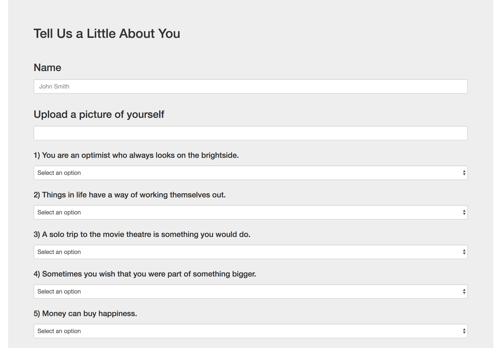
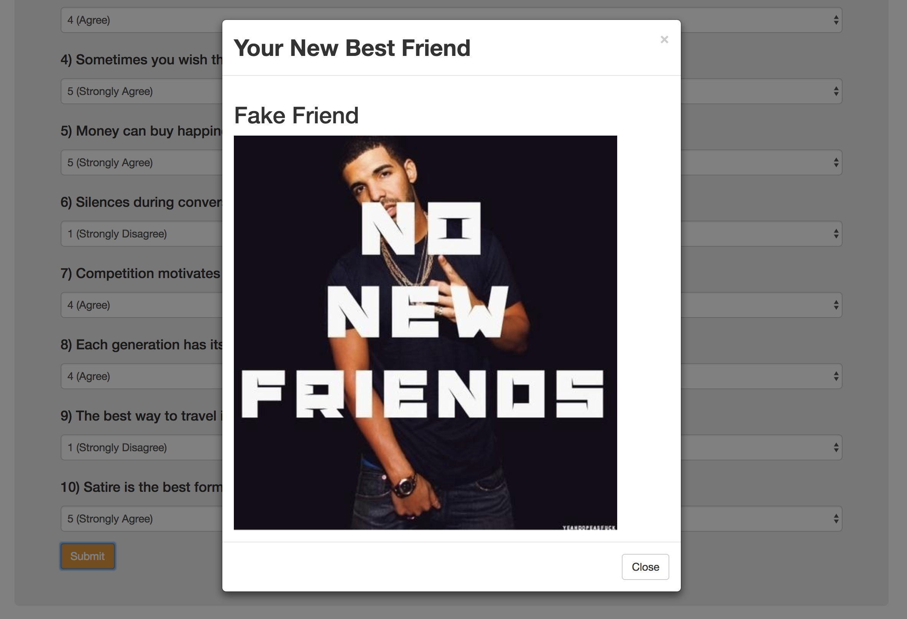

# FriendFinder

A Fullstack web application where users can answers questions to find their most compatible friend.

It utilizes an express server for storage of data on the backend for the get and post requests from the server.

The application uses jQuery AJAX calls for the post requests to the server.

The appplication utilizes Bootstrap for the layout of the page.

The [application is hosted on Heroku](https://friend-finder1994.herokuapp.com) and the following image is what users see when they first visit the site.

Once the user clicks on the **Find My New Friend** button, they will be routed to the following HTML page:

Once user submits the survey, application will run through all the stored friends and display the **best friend's** name with their picture.

The following image shows the **Fake Friend** profile that I created for this demonstration:

